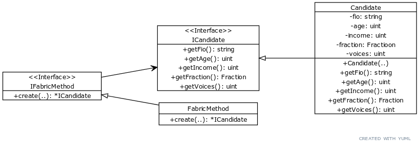

<div align="center">
Министерство науки и высшего образования Российской Федерации <br />
Федеральное государственное бюджетное образовательное учреждение <br />
высшего образования <br />
«Московский государственный технический университет <br />
имени Н.Э. Баумана <br />
(национальный исследовательский университет)» <br />
(МГТУ им. Н.Э. Баумана)
</div>
<hr />
<div align="center">
ФАКУЛЬТЕТ ИНФОРМАТИКА И СИСТЕМЫ УПРАВЛЕНИЯ <br />
КАФЕДРА КОМПЬЮТЕРНЫЕ СИСТЕМЫ И СЕТИ (ИУ6)
</div>
<br />
<div align="center">
ОТЧЕТ <br />
к лабораторной работе №2 <br />
по дисциплине "Современные средства разработки <br />
программного обеспечения" <br />
Реализация типовых решений с применением шаблонов проектирования.
</div>

<br />

Преподаватель: Фетисов М.В.

Студенты группы ИУ6-52Б Астахов Сергей Викторович, Лапшин Никита Валерьевич

## Описание задания

Задание: ШП Factory method (фабричный метод)

С использованием шаблона проектирования Factory method (фабричный метод)
выполните создание карточки из вашего домашнего задания и поместите ее в контейнер.
Выполните вывод содержимого контейнера в стандартный поток.

Предположим, что есть два вида кандидатов: кандидаты в Госдуму и в муниципальные собрания. В обоих случаях должен существовать метод получения информации о кандидате printInfo() и основанный на нем метод вывода списка кандидатов VotingList.printList(). Пусть в случае муниципального кандидата информация о доходе не является публичной и не должна выводиться методом printInfo(). Тогда используем шаблон фабричного метода, сам фабричный метод будем передовать в класс списка кандидатов (VotingList), чтобы он вызывался при добавлении кандидата.

## Адрес проекта

Проект хранится в репозитории по адресу: [u6-52b-svastakhov-nvlapshin-l2](https://bmstu.codes/lsx/mstd/iu6-5-2021/iu6-52b-svastakhov-nvlapshin/l2).

## Диаграмма классов



## Функция main

```c++
int main()
{
    CandidateGosdumiFM candidateGosdumiCreator;
    VotingList gosdumaVoting(&candidateGosdumiCreator);
    gosdumaVoting.addCandidate("Zhirinovsky V.V.", 75, 20000156, FRACTION_LDPR, 42345);
    gosdumaVoting.addCandidate("Kaz M.E", 36, 10000003, FRACTION_YABLOKO, 12043);
    gosdumaVoting.addCandidate("Zyganov G.A", 77, 15000002, FRACTION_KPRF, 24021);

    cout << "Gosduma list:\n" << endl;
    gosdumaVoting.printList();

    CandidateMunicipalFM candidateMunicipalCreator;
    VotingList municipalVoting(&candidateMunicipalCreator);
    municipalVoting.addCandidate("Urov S.G.", 38, 150202, FRACTION_EDRO, 8021);
    municipalVoting.addCandidate("Zhirkov E.I.", 61, 190213, FRACTION_EDRO, 7022);

    cout << "Municipal list:\n" << endl;
    municipalVoting.printList();

    return 0;
}
```

## Выводы

В данной лабораторной работе мы познакомились с основными ШП, а также реализовали на практике ШП Factory method (фабричный метод), позволяющий создавать объекты с заданным интерфейсом, абстрагируясь от их реализации. Кроме того, в ходе данной лабораторной работы был изучен процесс автоматической генерации документации с помощью CI сценариев.